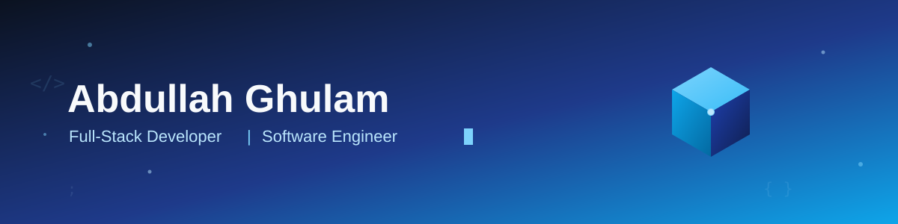

 

# 👋 Hi, I'm Abdullah Ghulam

### Software Engineer · Full-Stack Developer

Building scalable, secure, and modern web applications.

  

<!-- Profile Links -->

&nbsp;

&nbsp;

&nbsp;

&nbsp;

  

<!-- GitHub Ranking -->

<table>
<tr>
<td align="center">

<h3>🇦🇫 GitHub Contributor</h3>

 

Afghanistan · GitHub Contribution Ranking

</td>
</tr>
</table>

 

---

## 🚀 Tech Stack

### Languages & Frameworks

  

### Databases & Infrastructure

  

### Tools & UI

---

## 🐍 Contribution Activity

---

## 💬 Random Developer Quote

---

## 🌐 Let's Connect

&nbsp;&nbsp;&nbsp;

&nbsp;&nbsp;&nbsp;

 

### ⭐ Thanks for visiting my profile!

Feel free to explore my repositories and projects.

